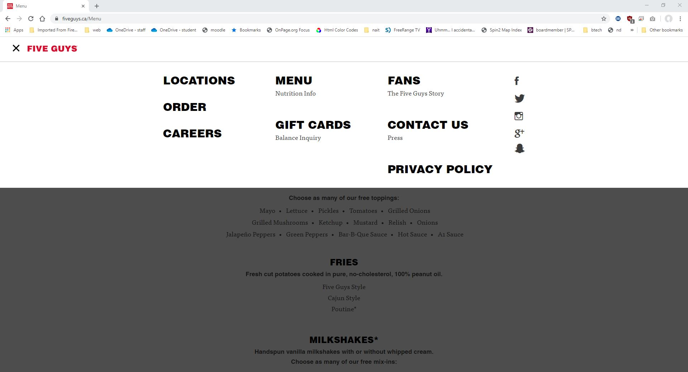

lets start with the menu page page of five guys.

It has a nav that extends across the browser and content that is constrained in the middle of the screen.

It has a large banner that extends across the browser with text centered in it

Next follows the menu which has a 3 column layout for the mains and centered content for the sides and drinks

Then there is a red bar with a link that goes across the browser

Finally the footer background extends across the browser with 4 columns on content.

Positioning is new thing in this demo.

Three different types of positioning are used on this page.

1. The header/nav stays at the top of the screen when you scroll down. The large banner image goes behind it.

1. This website uses a mobile style menu even on a desktop. It appears in front of the page when clicked.

1. When you click a menu item, information pops up in front of the page.

